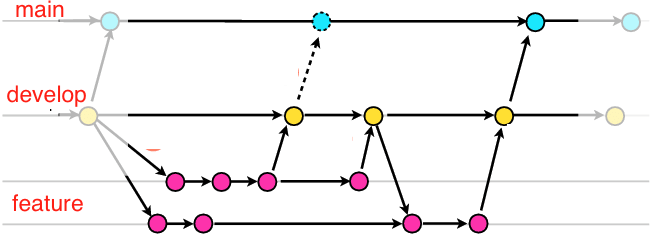
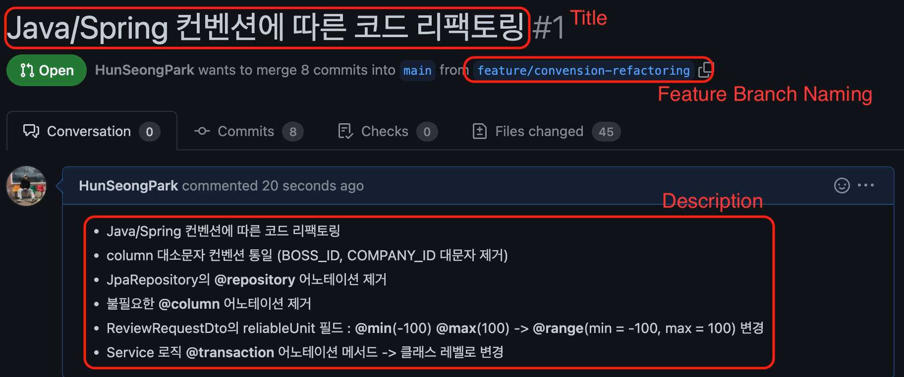

# Github Flow Guide

<aside>
💡 본문은 낭만(Nangman)의 Github Flow 가이드 입니다.

</aside>

## 목차

---

### [1. 소개 / 사용 가이드](https://github.com/Nangman-corp/Github-Flow-Guide/blob/main/README.md#1-%EC%86%8C%EA%B0%9C--%EC%82%AC%EC%9A%A9-%EA%B0%80%EC%9D%B4%EB%93%9C-1)

- [1.1 Github Flow](https://github.com/Nangman-corp/Github-Flow-Guide/blob/main/README.md#11-github-flow--develop-branch)

- [1.2 작업순서 별 GIT 명령어 가이드](https://github.com/Nangman-corp/Github-Flow-Guide/blob/main/README.md#12-%EC%9E%91%EC%97%85-%EC%88%9C%EC%84%9C-%EB%B3%84-git-%EB%AA%85%EB%A0%B9%EC%96%B4-%EA%B0%80%EC%9D%B4%EB%93%9C)

### [2. 컨벤션](https://github.com/Nangman-corp/Github-Flow-Guide/blob/main/README.md#2-%EC%BB%A8%EB%B2%A4%EC%85%98-1)

- [2.1 기능구현 역할 분배](https://github.com/Nangman-corp/Github-Flow-Guide/blob/main/README.md#21-%EA%B8%B0%EB%8A%A5%EA%B5%AC%ED%98%84-%EC%97%AD%ED%95%A0-%EB%B6%84%EB%B0%B0)

- [2.2 Feature Branch 네이밍 컨벤션](https://github.com/Nangman-corp/Github-Flow-Guide/blob/main/README.md#22-feature-branch-%EB%84%A4%EC%9D%B4%EB%B0%8D-%EC%BB%A8%EB%B2%A4%EC%85%98)

- [2.3 Commit Message 컨벤션](https://github.com/Nangman-corp/Github-Flow-Guide/blob/main/README.md#23-commit-message-%EC%BB%A8%EB%B2%A4%EC%85%98)

- [2.4 Pull Request - Create 컨벤션](https://github.com/Nangman-corp/Github-Flow-Guide/blob/main/README.md#24-pull-request---create-%EC%BB%A8%EB%B2%A4%EC%85%98)

- [2.5 Pull Request - Code Review 컨벤션](https://github.com/Nangman-corp/Github-Flow-Guide/blob/main/README.md#25-pull-request---code-review-%EC%BB%A8%EB%B2%A4%EC%85%98)

---

# 1. 소개 / 사용 가이드

---

협업 간 사용할 Github Flow에 대한 소개 및 사용 가이드를 설명합니다.

## 1.1. Github Flow + develop Branch

---

협업 간 사용할 Github Flow에 대해 설명합니다.



- Github Flow는 Git flow의 복잡성을 제거한 단순한 방식의 flow 입니다.
- **main** / **develop** / **feature** branch로 구성됩니다.

```markdown
feature branch : 기능 구현을 위한 브랜치로, 생성 - 삭제가 반복되는 작업 공간입니다.
develop branch : 새로 업데이트 될 버전의 코드가 업데이트 되는 브랜치입니다. 
main branch : 현재 **출시된** 최신 버전 프로덕트의 코드가 존재하는 메인 브랜치입니다.
```

### feature branch

- feature branch는 단위 기능 별 구현을 위해 생성 - 삭제가 반복되는 branch 입니다.
- feature branch는 항상 develop branch에서 분기되며, 최신 버전의 develop branch 코드를 pull 하여 작업합니다.
- feature branch는 main branch와 직접적으로 상호작용하지 않습니다.
- feature branch에서 단위 기능 별 정상 동작을 확인한 후 develop branch에 병합합니다.

### develop branch

- develop branch는 feature branch에서 병합된 다음 버전의 기능들이 관리되는 고정 branch 입니다.
- 새롭게 업데이트 될 버전의 기능 구현이 모두 develop branch에 병합되었다면 최종적으로 테스트를 수행한 후 main branch에 해당 develop branch를 병합합니다.

### main branch

- main branch는 현재 출시된 최신 버전에 해당하는 프로덕트의 코드가 존재하는 고정 branch 입니다.
- develop branch에서 다음 버전에 해당하는 기능이 모두 구현되어 해당 main branch에 병합되었다면, 다음 버전에 해당하는 버전 번호를 tag로 설정하여 main branch의 버전을 관리합니다.

## 1.2. 작업 순서 별 GIT 명령어 가이드

---

Github Flow 작업 순서에 따른 GIT 명령어 가이드를 설명합니다.

**토글을 펼치면 순서에 해당하는 GIT 명령어 가이드가 나타납니다.**

/ / main : 현재 Command Line 기준 main branch가 checkout 되어있음을 의미합니다.

/ / develop : 현재 Command Line 기준 develop branch가 checkout 되어있음을 의미합니다.

/ / feature : 현재 Command Line 기준 feature branch가 checkout 되어있음을 의미합니다.

- 0.  (최초 1회) 원격 저장소의 코드를 자신의 컴퓨터에 복제(Clone) 합니다.
    
    ```c
    git clone [URL] [소스코드가 저장될 폴더명]
    ```
    

- 1. 구현할 기능이 주어졌을 경우, develop branch에서 새로운 branch를 생성합니다.
    
    ```c
    git checkout develop // main
    git checkout -b [브랜치명] // develop
    
    git push -u origin [브랜치명] // feature, 원격 저장소에 해당 branch 생성
    ```
    
    - 본 명령어를 통해 branch를 생성함과 동시에 해당 branch로 checkout 됩니다.

- 2. 생성한 Branch에서 코드를 작성합니다.
    - 단위 기능 구현 중 git에서 별도로 처리할 작업은 없습니다.

- 3. 구현 작업에 대해 하나의 작업 단위 별로 커밋 메시지를 포함하여 커밋을 기록합니다.
    
    ```c
    git add . // Feature
    git commit -m "[커밋 메시지]"
    ```
    

- 3-1. 작업이 모두 완료된 경우 또는 작업 중 불필요한 커밋이 존재하는 경우 커밋을 합칠 수 있습니다.
    - **해당 Squash 작업은 반드시 push 전에 수행해야 합니다.**
    
     
    
    ```c
    git log --pretty=oneline // Feature
    ```
    
    위 커맨드 입력 시 아래와 같은 로그가 출력됩니다.
    
    ```c
    						[COMMIT ID]                    [COMMIT MESSAGE]
    
    1da8660499416696d8079da36f29d054c69b7d8a (HEAD -> master) add: r4
    4741e7919acb7e7658003aca658bca3623b904ed add: New2
    a595fbe76a1998a52da9c749d07cef453e8fb9bf add: New1
    879e279266224de9aeb4e82ae925c4e0e73ecef3 refactor: int bbbb change
    fb2dde72ad021740ddc57930e7b455f7c847fa08 add: Company
    a86002156495a27ad95594b3e1a56608e7d7d24e refactor: getName
    d89549e893b685d8ea2400ab45088104cbfb8308 add: User Entity
    458576123ffa41092eb0a57f880b598dccff9a00 init
    ```
    
    **add: New1** 커밋과 **add: New2** 커밋을 합친다고 가정했을 때, 합칠 커밋의 바로 아래 커밋 id를 복사하고, 
    
    아래 명령어를 입력합니다.
    
    ```c
    git rebase -i [복사한 커밋 ID] // Feature
    ```
    
    이후 문서 편집기가 실행되며 아래와 같은 문자열이 출력됩니다.
    
    ```c
    pick add: New2
    pick add: New1 
    ```
    
    문서 편집기를 통해 add: New1의 pick을 s(또는 squash)로 수정하여 위의 pick 커밋과 합쳐질 것임을 알립니다.
    
    ```c
    pick add: New2
    s add: New1 
    ```
    
    이후 저장을 수행하면, 문서 편집기가 실행되며 아래와 같은 문자열이 출력됩니다.
    
    ```c
    # This is a combination of 2 commits.
    # This is the 1st commit message:
    
    add: New2
    
    # This is the commit message #2:
    
    add: New1
    
    # Please enther the commit message ...
    ```
    
    기존의 커밋 메시지 앞에는 #을 붙여 없애고, # This is a combination of N commits 아래에 새로운 커밋 메시지를 작성합니다.
    
    ```c
    # This is a combination of 2 commits.
    [새로 작성할 커밋 메시지]
    # This is the 1st commit message:
    
    # add: New2
    
    # This is the commit message #2:
    
    # add: New1
    
    # Please enther the commit message ...
    ```
    
    해당 문서를 저장하면 커밋 합치기가 완료됩니다.
    

- 4. 구현이 완료되면 develop branch의 커밋 내역에 대해 Rebase를 수행합니다.
    
    ```c
    git checkout develop // feature
    git pull // develop
    git checkout [브랜치명] // develop
    git rebase develop // feature
    ```
    
    - 이 때, 충돌(Conflict)이 발생한 경우 Rebase가 일시정지됩니다.
    - 충돌이 발생한 경우, 충돌된 코드의 작성자와 회의를 통해 코드를 수정합니다.
    - 해당 코드 수정 완료 후 아래 명령어를 입력해 Rebase를 다시 진행합니다.
    
    ```c
    git rebase --continue // feature
    ```
    
    - 해당 명령어 입력 후 다른 충돌이 발생한 경우 위 과정을 반복합니다.
    - “Applying: ~” 메시지가 뜬다면 Rebase가 완료된 것입니다.

 

- 5. 원격 저장소에 해당 branch의 커밋 내역을 push합니다.
    
    ```c
    git push -u origin [브랜치명] // feature
    ```
    

- 6. 해당 branch를 develop branch에 병합(Merge) 요청하는 Pull Request를 생성합니다.
    - Github의 해당 프로젝트 Repository에서 해당 branch → develop의 PR을 생성합니다.

- 7. 팀원 간 Pull Request에 대해 코드 리뷰 및 기능의 정상 동작 여부를 확인합니다.
    
    

- 8. 테스트가 완료된 경우, 해당 Pull Request에 대해 develop branch로의 병합을 수행합니다.
    - Github의 해당 프로젝트 Repository에서 해당 PR에 대해 **Rebase and Merge**

- 9. 작업이 완료 된 feature branch는 원격 저장소 / 로컬 저장소에서 삭제합니다.
    
    ```c
    git checkout develop // feature
    git push origin --delete [브랜치명] // develop, 원격 저장소에서 branch 삭제
    git branch -D [브랜치명] // develop, 로컬 저장소에서 branch 삭제
    
    git pull // develop, 최신 버전의 develop branch 소스코드 가져오기
    ```
    

# 2. 컨벤션

---

협업 간 역할 분배, 네이밍과 같은 일관된 컨벤션을 설명합니다.

## 2.1. 기능구현 역할 분배

---

기능 구현을 위한 팀 내 역할 분배에 대해 설명합니다.

1. 회의를 통해 구현해야 할 내용을 스프린트 별로 정리합니다. 
2. 스프린트를 통하여 구현내용을 순차적으로 나열합니다. 작업 단위로 나눠진 스프린트는 **Ticket** 혹은 **card**라고 부릅니다.
3. 개발자는 커뮤니케이션을 통해 Ticket을 가져가고, 해당 기능을 주어진 스프린트 기간 동안 구현합니다.

### 역할 분배에서 주의할 점

- 협업 간 Code Conflict를 방지하기 위해 각 작업 단위는 다른 작업의 자원을 침범하지 않아야 합니다.
- 만약 하나의 자원에 대해 여러 기능구현이 나누어져 있다면, 가급적 한 명이 해당 자원의 Ticket들을 맡습니다.

## 2.2. Feature Branch 네이밍 컨벤션

---

각 작업 별로 생성되는 feature branch의 네이밍 컨벤션을 설명합니다.

### Category

- **feature :** 기능 구현
- **issue** : Github Repository에 등록된 issue에 대한 해결

### Description

- feature description: 구현할 기능을 설명합니다. 영문으로 작성하며, 공백은 “-”으로 구분합니다.
- issue description: #issue 번호를 적습니다. 세부적인 description은 issue 탭에서 확인합니다.

```c
feature/user-signup
feature/company-address-edit

issue/#8
issue/#122
```

## 2.3. Commit Message 컨벤션

---

단위 작업 완료 후 커밋 시 메시지에 대한 컨벤션을 설명합니다.

### Behavior

- **feat :** 새로운 기능 추가
- **fix** : 버그, 코드 충돌 수정
- **docs** : 문서 수정 (주석 등)
- **style** : 코드 포맷팅 등 코드 로직의 변경이 아닌 경우
- **refactor**: 코드 리팩토링
- **test**: 테스트 코드
- **chore**: Build 관련 수정 (build.gradle etc…)

### Title

- 한글 / 영어 모두 작성 가능합니다.
- 50자 이내로 작성합니다.
- 영어로 작성 시 제목의 첫 글자는 대문자로 작성합니다.
- 작업 내용을 명확하게 이해할 수 있도록 서술합니다.
- 마침표를 붙이지 않습니다.

```c
[Behavior: Title]

feat: User-Company Entity 연관관계 수정
```

### Body

- 선택사항으로, 모든 커밋에 본문을 작성할 필요는 없습니다.
- 부연설명이 필요하거나, Title만으로는 설명이 부족한 경우 작성합니다.
- Title과의 구분을 위해 한 줄을 띄고 작성합니다.

## 2.4. Pull Request - Create 컨벤션

---

Pull Request를 생성할 때 작성할 내용을 설명합니다.

### Title

Ticket의 제목과 동일하게 작성합니다.

### Description

구현한 기능, 해결한 이슈에 대해 리스트 형식으로 나열합니다.

해당 영역은 Ticket의 본문 내용과 일치할 수도 있고, 실제 구현에 따라 달라질 수도 있습니다.

```c
- User 회원가입 구현
- User 회원가입 Validation
- UserSignupService Test
```



## 2.5. Pull Request - Code Review 컨벤션

---

생성된 Pull Request에 대한 코드 리뷰를 설명합니다.

<aside>
💡 해당 섹션은 내부 회의를 통해 명확한 Rule을 정할 필요가 있습니다.

</aside>

### Contributors
---
[박훈성](https://github.com/HunSeongPark)이 작성하였습니다.
- [Contributors](https://github.com/Nangman-corp/JSON-Value-Style-Guide/graphs/contributors)
